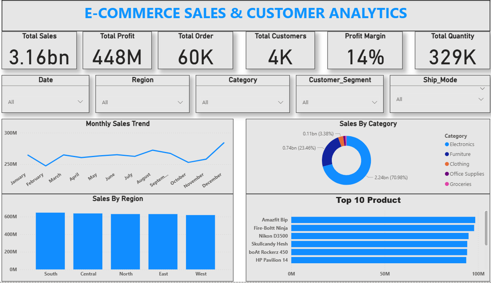

# 📊 E-Commerce Sales & Customer Analytics Dashboard

## 📌 Project Overview

This project is an interactive E-Commerce Sales & Customer Analytics Dashboard built using Microsoft Power BI.

The dashboard provides insights into sales performance, profit, orders, customers, quantity, regional performance, product performance, and customer segments.

## 🛠️ Tools & Technologies

- Microsoft Power BI
- DAX
- Power Query
- Excel / CSV
- Data Visualization

## 📊 Key KPIs

- Total Sales: 3.16B
- Total Profit: 448M
- Total Orders: 60K
- Total Customers: 4K
- Total Quantity: 329K
- Profit Margin: 14%

## 📈 Dashboard Features

- Monthly Sales Trend
- Sales by Region
- Sales by Category
- Top 10 Products
- Customer Segment Analysis
- Ship Mode Analysis
- Interactive Date Filter
- Interactive Region Filter
- Interactive Category Filter
- Interactive Customer Segment Filter
- Interactive Ship Mode Filter

## 🧮 DAX Measures

The project uses DAX measures for calculating:

- Total Sales
- Total Profit
- Total Orders
- Total Customers
- Total Quantity
- Profit Margin

## 📷 Dashboard Preview

## 📂 Files Included

- `Ecommerce_Sales_Customer_Analytics.pbix` — Power BI dashboard file
- `Ecommerce_Dashboard.png` — Dashboard screenshot
- `ecommerce_sales_data_60000_power_bi.csv` — Dataset
- `README.md` — Project documentation

## 🎯 Business Insights

This dashboard helps identify:

- Overall sales and profit performance
- Regional sales performance
- Monthly sales trends
- Best-performing products
- Category-wise sales contribution
- Customer segment performance

## 👨‍💻 Author

**Sudhansu Mahapatra**

B.Tech CSE | Data Analytics Learner

Skills: Power BI | SQL | Excel | Python | DAX
